# Tarea 4
---
### [Documentacion](https://65b6d848213eeeb15380d012--clever-chimera-c597c7.netlify.app/)
---
## Ejecución 

Para correr el programas hay que seguir las siguientes indicaciones:

1. Clonar el repositorio

 ```
 git clone https://github.com/bryanco03/ie0217.git
```

2. Ponerse en el directorio Tarea_TRES

Si estas en Windows
 ```
  cd .\ie0217\Tareas\TAREA_CUATRO\
```
Si estas en linux
 ```
  cd ie0217/Tareas/TAREA_CUATRO/

```
---


3. Ejecutar el makefile (Asegurarse que se tenga instalado)

Si estas en windows
 ```
mingw32-make
```
si estas en linux

 ```
make
```
4. Disfruta del Programa

---
## Parte 2 Practica rendimiento del programa

Para medir la eficiencia y el redimiento del programa se utulizaron programa como cProfile para observar el tiempo de ejecucion ante 11 alergias y con 50 alergias.

### Con 11 Alergias.


Con 11 alergias esas fueron los tiempos arrojados por cProfile, se observa que en la mayoria de metodos y funciones sus tiempos son muy pequeños, la ejecucion del programa fueron 86.470 segundos los cuales 86.436 segundos fueron el programa esperando una entrada del usuario, por lo cual quedan 0.034 segundos, los cuales corresponde a la ejecucion de los metodos de los objetos y funciones, los cuales se podria decir que trabajan de forma instantanea.


### Con 50 Alergias.
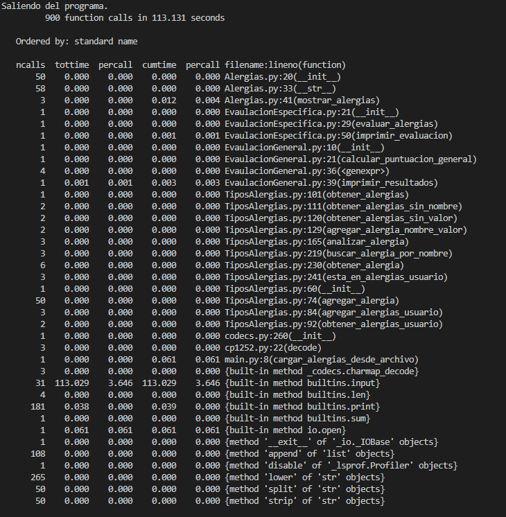

Estos fueron los tiempos arrojados por cProfile con 50 alergias, al igual que con 11 alergias, la mayoria de metodos y funciones sus tiempos son muy pequeños, la ejecucion del programa fueron 113.131 segundos los cuales 113.029 segundos fueron el programa esperando una entrada del usuario, por lo cual quedan 0.102 segundos que es aproximadamente 3 veces mayor, se obseva que gran parte de este tiempo fue la funcion cargar_alergias_desde_archivo el cual duró 0.061 segundos, esta funcion es la encargada de pasar el archivo de texto Alergias a codigo, si contar este tiempo se tiene que 0.041 segundos correspondientes a los demas metodos y funciones, las cuales fueron ejecutados de la misma forma que en el caso de 11 alergias las cuales tuvo la duracion de 0.034 segundos, lo cual se aprecia que la diferencia de tiempo es mayormente es por la carga del archivo de texto, ya que  el tiempo de toman las demas funciones y metodos son muy similar entre 11 y 50 alergias ya que su diferencia es de solo 0.007 segundos, que para efectos practico es practicamente inperceptibles.

Por otro lado se hiceron mediciones de tiempo en las funciones utilizada para cada opcion que proporcina el programa, teniendo los siguientes resultados:

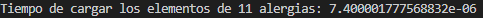
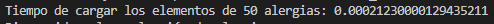

El tiempo de carga es el que mas diferecia hay es el de la carga de los elementos, aunque puede ser porque las 50 alergias se cargan desde un archivo txt, mientras que las 11 alergias son cargadas directamente al programa, aun asi este es el aspecto que mas se ve afectado por el numero de entradas al programa

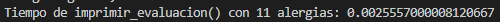
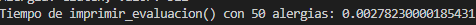

Esta es la opcion del programa de Puntuacion de alergias, se observa que la diferencia es minima ante la entrada de la misma puntuacion en los casos, aunque puede que el tiempo aumente ante una puntuacion mas grande en el caso de 50 alergias, a comparacion el de 11 alergias, esto debido a los valores que contienen las 11 alergias llegan hasta 2047, y los 50 valores llegan a un valor muchisimo mas alto.

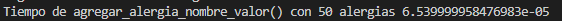
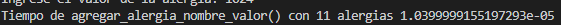

En el caso de agregar una alergia por nombre y valor se aprecia que si hay una diferencia notoria entre 50 y 11 alergias, en este caso, se agrego el ultimo elemento de la lista de alergias, si bien en este método se busca y se recorre la lista verificando si el nombre y el valor coinciden se podria hacer de otra manera mas eficiente, ya que debido a que la lista se encuentra de forma ordenada de forma ascendente con los valores, se podria realizar una busqueda binaria en la lista, y al encontrar el valor, se verifica si se cumple que ambos nombres sean iguales, ya que se evita recorrer toda la lista para buscar un solo elemento.


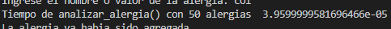
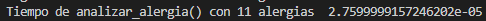

En el caso de analizar_alergia() es de una manera similar al anterior, en ambos casos se ingreso el ultimo elemento de la lista, y se puede hacer de manera mas eficiente de la misma forma que el anterior caso cuando se ingrese un valor, el caso de ingresar un
nombre, la estructura se mantiene igual.

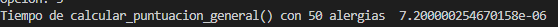
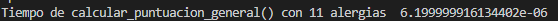

En este caso la diferencia no es tan notable, ya que las mediciones se realizan con las mismas condiciones, en este caso, con las 50 alergias puede durar mas debido aque puede haber mas alergias almacenadas en la lista del usuario, aunque, compararlo con cantidades compatibles con 11 alergias, la diferencia no es mucha.


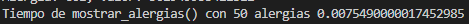
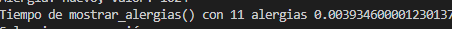

En mostrar_alergias() se puede observar que con 50 alergias se dura casi el doble que con 11 alergias, obviamente es debido a que la lista de 50 es mayor que la de 11, aunque los tiempos son cortos, en este caso la diferencia si es notable al medir los tiempos

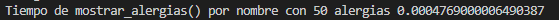
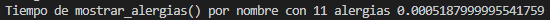

Este caso es particular debido a que se duro un poco mas con 11 alergias, que con 50 alergias aunque la diferencia es menor que 0.048 ms, y parecido con analizar_alergia() este metodo busca por nombre una alergia, si se deseara mejor la eficiencia, se podria buscar por valor y por medio de la busqueda binario se mejoraria el rendimiento.  

---
## Parte Teórica
---
1. Explique la diferencia entre una lista y una tupla en Python.

La principal diferencia entre una lista y una tupla es que la tupla es inmutables, es decir que no se pueden cambiar los elementos adentro de la tupla, ni agrega ni eliminar elementos, mientras que las listas si son mutables, por lo tanto se puden modificar los elementos adentro de la lista

2. ¿Qué es la sobrecarga de operadores en Python y cómo se implementa?

La sobrecarga de operadores es la capacidad de definir y asignar un comportamiento espeficico a un operador (+,-,*./, ..., etc) a tipos de datos personalizados como lo son los objetos.

Para implementarlo, se utilizan los metodos magicos, que tiene la forma de \__operador\__ y dentro de ellos se define el comportamiento que se desea tener.  

3. Explique el concepto de "alcanzabilidad"(scope) de una variable en Python.


 El scope se refiere al ámbito en el que una variable es accesible dentro de un programa, en python hay diferentes scopes como:
 - Alcance local: Las variables definidas dentro de una función solo son accesibles dentro de esa función.

- Alcance global: Las variables definidas fuera de todas las funciones y clases son accesibles desde cualquier parte del código.


4. ¿Qué es un decorador en Python y cuál es su función principal?

Un decorador en Python es una función que recibe otra función como entrada y devuelve una versión modificada de esa función original. Usualmente, esta versión modificada agrega alguna funcionalidad adicional sin alterar el código original de la función. El propósito principal de un decorador es alterar o ampliar el comportamiento de una función existente sin modificar directamente su implementación. Para lograr esto, el decorador envuelve la función original dentro de una nueva función que proporciona la funcionalidad adicional deseada, como ejecutar acciones antes o después de la función original, modificar sus argumentos o su resultado, o manejar excepciones.[1]


5. ¿Cómo se gestionan las excepciones en Python? Proporcione ejemplos de uso de bloques
try, except y finally.

Las excepciones se gestionan mediante bloques `try`, `except` y `finally`. Estos bloques proporcionan un mecanismo para manejar errores y excepciones que pueden ocurrir durante la ejecución de un programa.

El bloque `try` contiene las instrucciones que se desea ejecutar, pero es posible que ocurran errores durante su ejecución. Si se produce un error, el bloque se detendrá y el flujo de control pasará al bloque `except`.

El bloque `except` Este bloque se ejecutará si el bloque `try` falla debido a un error. Contiene instrucciones que suelen proporcionar información sobre lo que salió mal en el bloque `try`.

El bloque `finally` siempre se ejecuta independientemente de lo que suceda en los otros bloques. [2]


6. ¿Qué son los generadores en Python y para qué se utilizan?

Los generadores en Python son una manera práctica de construir iteradores. Son útiles para producir secuencias de valores de manera eficiente, evitando la necesidad de almacenar todos los valores en la memoria al mismo tiempo. En lugar de generar una lista completa de valores, un generador produce valores según sea necesario, a medida que se solicitan.


7. Explique la diferencia entre init y call en clases de Python.

El init es un metodo que se llama al instanciar la clase en un objeto, u propósito es inicializar los atributos de la instancia con los valores predeterminados o los proporcionados por el usuario. 

El call es un método que se ejecuta cuando el objeto es llamado como una funcion u propósito es hacer que la instancia sea ejecutable y pueda realizar alguna acción.

8. ¿Cómo se organizan los módulos y paquetes en Python? ¿Qué es \__init__.py?

los módulos son archivos que contienen código Python, como funciones o clases, y se utilizan para organizar el código en archivos separados para su reutilización. Los paquetes son carpetas que contienen módulos y un archivo especial llamado 
\__init__.py. Este archivo indica que la carpeta debe tratarse como un paquete de Python y puede contener código de inicialización para el paquete.[3]


9. Explique la diferencia entre métodos append() e extend() en listas de Python.

El método append() se utiliza para agregar un solo elemento al final de la lista, mientras que extend() se usa para agregar varios elementos, generalmente otra lista de elementos.

10. ¿Cuál es la diferencia entre un metodo de clase y un método estático en Python?

Los métodos de clase son métodos que operan en el ámbito de la clase en lugar de en una instancia específica. Para definir un método de clase en Python, se usa el decorador `@classmethod` y  se debe añadir cls como primer parámetro en la definición del método. Esto permite acceder a los atributos y métodos de la clase dentro del método. Los métodos de clase son útiles cuando se quiera realizar operaciones que afecten a la clase en su conjunto en lugar de a instancias individuales.

Los métodos estáticos son métodos que son parte de una clase, pero no dependen ni de la clase ni de una instancia de la misma. Por lo tanto, no necesitan un parámetro principal como los métodos normales o de clase. Estos métodos suelen estar relacionados con la clase de alguna manera y no necesitan estar en un módulo separado.
Para definir un método estático en Python, simplemente se usa el decorador `@staticmethod`. Esto hace que el método esté asociado con la clase, pero no requiera una referencia a la instancia o a la clase en sí misma.[4]


11. Hable sobre las diferencias entre herencia simple y herencia múltiple en Python.

En la herencia simple en la clase derivada hereda de una sola clase base, mientras que en la herencia multiple la clase derivada hereda de dos o mas clases bases.


12. ¿Cómo se manejan los errores de importación de módulos en Python?

Los errores de importación de módulos se manejan utilizando excepciones, y son utiles para cuando no se encuentra el modulo o hay un error al importarlo, se maneja de la siguiente manera:

 Se emplea un bloque try-except para probar la importación de un módulo, utilzando la excepcion `ImportError` la cual es la que salta cuando se provoca una excepcion en estos casos.


13. ¿Cuál es la diferencia entre una clase y un objeto en Python?

Una clase es como un modelo que define las características y comportamientos que tendrán los objetos de ese tipo. Por otro lado, un objeto es una instancia concreta de una clase, que hereda las características y comportamientos definidos por la clase


14. Hable sobre la diferencia entre una clase abstracta y una interfaz en Python.

Una clase abstracta en Python es una plantilla de clase que no se puede crear directamente, sino que se utiliza como modelo para otras clases. Puede incluir métodos abstractos, que son métodos que deben ser implementados por las clases que heredan de ella. Aunque Python no tiene un concepto de interfaz como en otros lenguajes, se puede simular una interfaz utilizando una clase abstracta con todos sus métodos marcados como abstractos utilizando el modulo `abc`  . Una interfaz define un conjunto de métodos que deben ser implementados por cualquier clase que la utilice.


15. Explique el concepto de sobreescritura de métodos en Python y cómo se realiza

La sobreescritura de métodos en Python es cuando una clase hija define su propia versión de un método que ya está presente en la clase padre. Esto le da a la clase hija la capacidad de cambiar o agregar comportamiento al método que hereda de su clase padre.

# Referencias

[1] [readthedocs.io ](https://python-intermedio.readthedocs.io/es/latest/decorators.html)

[2] [freeCodeCamp](https://www.freecodecamp.org/espanol/news/sentencias-try-y-except-de-python-como-menejar-excepciones-en-python/)

[3] [LearnPython](https://www.learnpython.org/es/Modules%20and%20Packages#:~:text=Son%20simplemente%20directorios%2C%20pero%20d%C3%A1ndole%20un%20giro.%20Cada,la%20misma%20manera%20que%20se%20importa%20un%20m%C3%B3dulo.)


[4] [cosasdedevs](https://cosasdedevs.com/posts/metodos-clase-metodos-estaticos-python/#:~:text=Los%20m%C3%A9todos%20de%20clase%20se%20emplean%20a%20nivel,clase%2C%20pero%20no%20precisan%20un%20uso%20de%20clase.)

